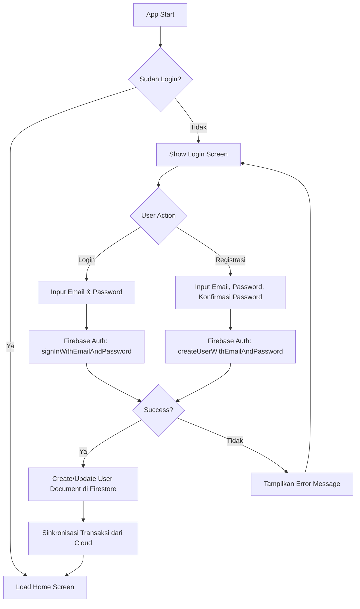
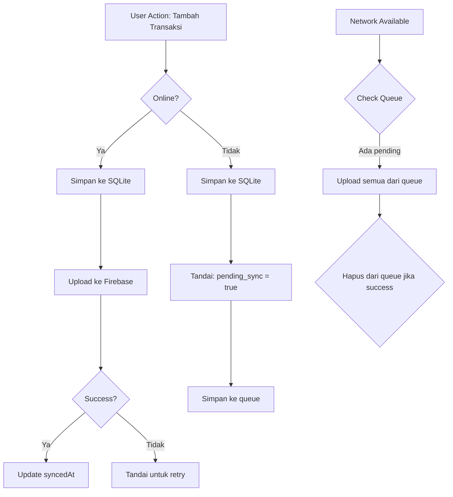

# Arsitektur Fitur Login Email - Money Tracker

## 1. Pendahuluan

Dokumen ini menjelaskan arsitektur untuk menambahkan fitur login dengan email pada aplikasi Money Tracker Flutter. Arsitektur ini dirancang untuk:

- Memungkinkan user melakukan registrasi dan login dengan email
- Menyimpan data user di cloud (Firebase) sehingga data tidak hilang meskipun aplikasi dihapus
- Menyediakan desain modern untuk layar login
- Berintegrasi dengan database SQLite yang sudah ada
- Memungkinkan sinkronisasi data transaksi ke cloud

## 2. Rekomendasi Solusi Cloud

### Firebase adalah pilihan yang tepat karena:

| Aspek | Firebase |
|-------|----------|
| **Autentikasi** | Firebase Auth mendukung login dengan email/password dengan mudah |
| **Database** | Cloud Firestore atau Realtime Database untuk menyimpan data user dan transaksi |
| **Offline Support** | Firebase SDK memiliki fitur offline-first yang baik |
| **Keamanan** | Firebase menyediakan security rules yang kuat |
| **Gratis Tier** | Spark Plan gratis dengan batas yang cukup untuk aplikasi baru |
| **Integrasi Flutter** | Package firebase_core dan firebase_auth tersedia untuk Flutter |

### Alternatif yang Dipertimbangkan:

1. **Supabase** - Alternatif open-source dengan fitur serupa, tapi Firebase lebih mature
2. **AWS Amplify** - Lebih kompleks, overkill untuk aplikasi ini
3. **Custom Backend** - Membutuhkan server sendiri, lebih mahal dan kompleks

**Kesimpulan: Firebase adalah pilihan optimal untuk aplikasi ini.**

## 3. Struktur Data User dan Model

### 3.1 Model User (Cloud Firestore)

```dart
class User {
  final String uid;           // Firebase Auth User ID
  final String email;         // Email user
  final String? displayName;  // Nama tampilan (opsional)
  final DateTime createdAt;   // Tanggal registrasi
  final DateTime? lastLogin;  // Login terakhir
  final String? photoURL;    // URL foto profil (opsional)
}
```

### 3.2 Struktur Database Cloud

```
/users/{uid}
  - email: string
  - displayName: string (optional)
  - createdAt: timestamp
  - lastLogin: timestamp (optional)

/users/{uid}/transactions/{transactionId}
  - description: string
  - amount: double
  - category: string
  - type: "income" | "expense"
  - date: timestamp
  - syncedAt: timestamp (waktu sinkronisasi terakhir)
  - localId: int (ID dari SQLite lokal)

/users/{uid}/categories/{categoryId}
  - name: string
  - type: "income" | "expense"
  - icon: string
  - color: int
  - isDefault: boolean
```

### 3.3 Model User di Flutter

```dart
// lib/models/user.dart
class UserModel {
  final String uid;
  final String email;
  final String? displayName;
  final DateTime createdAt;
  final DateTime? lastLogin;

  UserModel({
    required this.uid,
    required this.email,
    this.displayName,
    required this.createdAt,
    this.lastLogin,
  });

  Map<String, dynamic> toMap() {
    return {
      'uid': uid,
      'email': email,
      'displayName': displayName,
      'createdAt': createdAt.toIso8601String(),
      'lastLogin': lastLogin?.toIso8601String(),
    };
  }

  factory UserModel.fromMap(Map<String, dynamic> map) {
    return UserModel(
      uid: map['uid'] ?? '',
      email: map['email'] ?? '',
      displayName: map['displayName'],
      createdAt: map['createdAt'] != null 
          ? DateTime.parse(map['createdAt']) 
          : DateTime.now(),
      lastLogin: map['lastLogin'] != null 
          ? DateTime.parse(map['lastLogin']) 
          : null,
    );
  }
}
```

## 4. Flow Autentikasi

### 4.1 Diagram Flow Login/Registrasi



### 4.2 Proses Registrasi

```
1. User mengisi form registrasi:
   - Email (wajib, valid format)
   - Password (min 8 karakter)
   - Konfirmasi Password (harus sama)

2. Validasi input:
   - Email tidak boleh kosong dan harus valid
   - Password minimal 8 karakter
   - Password dan konfirmasi harus sama

3. Firebase Auth: createUserWithEmailAndPassword()

4. Jika berhasil:
   - Simpan document user ke Firestore
   - Buat koleksi transactions kosong
   - Sinkronisasi default categories dari cloud
   - Arahkan ke Home Screen

5. Jika gagal:
   - Tampilkan pesan error yang sesuai
```

### 4.3 Proses Login

```
1. User mengisi form login:
   - Email
   - Password

2. Validasi input:
   - Email tidak boleh kosong
   - Password tidak boleh kosong

3. Firebase Auth: signInWithEmailAndPassword()

4. Jika berhasil:
   - Update lastLogin di Firestore
   - Load transaksi dari cloud ke SQLite lokal
   - Load kategori dari cloud
   - Arahkan ke Home Screen

5. Jika gagal:
   - Tampilkan pesan error (email/password salah)
```

### 4.4 Proses Logout

```
1. User memilih logout
2. Firebase Auth: signOut()
3. Hapus data user dari shared preferences
4. Opsional: Biarkan data lokal atau hapus
5. Arahkan ke Login Screen
```

## 5. Struktur Folder dan File

### 5.1 Struktur Folder Proposed

```
lib/
├── main.dart                          # Entry point (MODIFIED)
├── models/
│   ├── user.dart                      # NEW - Model user
│   ├── transaction.dart               # MODIFIED - Tambah field synced
│   └── category.dart                  # MODIFIED - Tambah field synced
├── screens/
│   ├── login_screen.dart              # NEW - Layar login
│   ├── register_screen.dart           # NEW - Layar registrasi
│   ├── splash_screen.dart             # NEW - Layar loading
│   ├── home_screen.dart               # MODIFIED - Tambah check auth
│   ├── main_navigation.dart           # MODIFIED - Tambah auth guard
│   └── ... (existing screens)
├── services/
│   ├── auth_service.dart               # NEW - Service autentikasi
│   ├── firebase_service.dart          # NEW - Inisialisasi Firebase
│   └── sync_service.dart              # NEW - Service sinkronisasi
├── providers/
│   ├── auth_provider.dart             # NEW - State management auth
│   └── user_provider.dart             # NEW - State management user
├── database/
│   ├── database_helper.dart           # MODIFIED - Tambah user_id
│   └── firebase_helper.dart           # NEW - Firebase operations
├── widgets/
│   └── ... (existing widgets)
└── utils/
    ├── constants.dart                  # NEW - Konstanta app
    └── validators.dart                 # NEW - Validasi input
```

### 5.2 File yang Perlu Dibuat

| File | Deskripsi |
|------|-----------|
| `lib/models/user.dart` | Model user untuk Firebase |
| `lib/screens/splash_screen.dart` | Layar loading saat inisialisasi |
| `lib/screens/login_screen.dart` | Layar login dengan email/password |
| `lib/screens/register_screen.dart` | Layar registrasi user baru |
| `lib/services/auth_service.dart` | Service untuk operasi Firebase Auth |
| `lib/services/firebase_service.dart` | Inisialisasi dan konfigurasi Firebase |
| `lib/services/sync_service.dart` | Service untuk sinkronisasi data |
| `lib/providers/auth_provider.dart` | State management untuk autentikasi |
| `lib/providers/user_provider.dart` | State management untuk data user |
| `lib/database/firebase_helper.dart` | Helper untuk operasi Firestore |
| `lib/utils/constants.dart` | Konstanta aplikasi |
| `lib/utils/validators.dart` | Validasi input form |

## 6. UI/UX Design Concept

### 6.1 Color Palette

```dart
// Primary Colors
const primaryColor = Color(0xFF6366F1);      // Indigo - main brand
const primaryLight = Color(0xFF818CF8);      // Light indigo
const primaryDark = Color(0xFF4F46E5);       // Dark indigo

// Secondary Colors
const secondaryColor = Color(0xFF10B981);   // Emerald - success
const accentColor = Color(0xFFF59E0B);      // Amber - accent

// Background Colors
const backgroundColor = Color(0xFFF9FAFB);  // Light gray
const surfaceColor = Color(0xFFFFFFFF);     // White
const cardColor = Color(0xFFFFFFFF);         // White card

// Text Colors
const textPrimary = Color(0xFF111827);      // Dark gray
const textSecondary = Color(0xFF6B7280);    // Medium gray
const textHint = Color(0xFF9CA3AF);          // Light gray

// Error Colors
const errorColor = Color(0xFFEF4444);       // Red
const successColor = Color(0xFF10B981);      // Green
```

### 6.2 Layout Login Screen

```
┌─────────────────────────────────────┐
│         [Logo/App Name]             │
│                                     │
│        💰 CatatUangku!              │
│        Money Tracker App            │
│                                     │
├─────────────────────────────────────┤
│                                     │
│  ┌─────────────────────────────┐   │
│  │ 📧 Email                     │   │
│  └─────────────────────────────┘   │
│                                     │
│  ┌─────────────────────────────┐   │
│  │ 🔒 Password            👁   │   │
│  └─────────────────────────────┘   │
│                                     │
│  ┌─────────────────────────────┐   │
│  │       LOGIN                  │   │
│  └─────────────────────────────┘   │
│                                     │
│         Lupa Password?              │
│                                     │
├─────────────────────────────────────┤
│                                     │
│   Belum punya akun? Daftar          │
│                                     │
└─────────────────────────────────────┘
```

### 6.3 Layout Register Screen

```
┌─────────────────────────────────────┐
│         [Back Button]               │
│                                     │
│        Buat Akun Baru               │
│                                     │
├─────────────────────────────────────┤
│                                     │
│  ┌─────────────────────────────┐   │
│  │ 👤 Nama Lengkap             │   │
│  └─────────────────────────────┘   │
│                                     │
│  ┌─────────────────────────────┐   │
│  │ 📧 Email                     │   │
│  └─────────────────────────────┘   │
│                                     │
│  ┌─────────────────────────────┐   │
│  │ 🔒 Password            👁   │   │
│  └─────────────────────────────┘   │
│                                     │
│  ┌─────────────────────────────┐   │
│  │ 🔒 Konfirmasi Password 👁   │   │
│  └─────────────────────────────┘   │
│                                     │
│  ┌─────────────────────────────┐   │
│  │       DAFTAR                 │   │
│  └─────────────────────────────┘   │
│                                     │
├─────────────────────────────────────┤
│                                     │
│   Sudah punya akun? Login           │
│                                     │
└─────────────────────────────────────┘
```

### 6.4 Komponen UI yang Diperlukan

1. **Custom Text Field**
   - Dengan icon prefix
   - Dengan toggle visibility untuk password
   - Dengan error message
   - Dengan border states (default, focused, error)

2. **Custom Button**
   - Primary button (solid color)
   - Secondary button (outline)
   - Loading state dengan spinner
   - Disabled state

3. **Logo/App Icon**
   - Dengan gradient background
   - Animasi saat loading

### 6.5 Animasi dan Transisi

- **Screen Transition**: Slide from right untuk register
- **Button Press**: Scale down 0.95 dengan 100ms duration
- **Loading**: Circular progress indicator dengan brand color
- **Error**: Shake animation untuk invalid input

## 7. Integrasi dengan SQLite yang Ada

### 7.1 Perubahan pada DatabaseHelper

```dart
// Tambahkan user_id ke setiap tabel
class DatabaseHelper {
  // Tabel transactions - tambah user_id
  // Tabel categories - tambah user_id
  
  // Method baru: getTransactionsByUserId()
  // Method baru: getCategoriesByUserId()
  // Method baru: deleteAllUserData() - untuk logout
}
```

### 7.2 Strategi Penyimpanan Hybrid

```
┌─────────────────────────────────────────┐
│              Local Storage              │
│  ┌───────────────────────────────────┐   │
│  │ SQLite (Transactions & Categories)│   │
│  │ - Data sementara lokal            │   │
│  │ - Tidak terikat dengan user       │   │
│  └───────────────────────────────────┘   │
└─────────────────────────────────────────┘
                    ↕ Sinkronisasi
┌─────────────────────────────────────────┐
│              Cloud Storage              │
│  ┌───────────────────────────────────┐   │
│  │ Firebase Firestore                 │   │
│  │ - Data permanen user              │   │
│  │ - Tersedia di semua perangkat     │   │
│  └───────────────────────────────────┘   │
└─────────────────────────────────────────┘
```

## 8. Strategi Sinkronisasi Data

### 8.1 Types of Sync

| Trigger | Jenis Sync | Deskripsi |
|---------|------------|-----------|
| Login | Full Sync | Download semua data dari cloud |
| Tambah Transaksi | Real-time Sync | Langsung upload ke cloud |
| Edit Transaksi | Real-time Sync | Update di cloud |
| Hapus Transaksi | Real-time Sync | Hapus dari cloud |
| Logout | Local Only | Data tetap di lokal |
| Offline → Online | Catch-up Sync | Upload semua data lokal |

### 8.2 Sync Flow



### 8.3 Conflict Resolution

```
Strategi: Last-Write-Wins (sederhana)

1. Setiap transaksi punya:
   - localUpdatedAt: waktu update di lokal
   - cloudUpdatedAt: waktu update di cloud

2. Saat sinkronisasi:
   - Jika cloudUpdatedAt > localUpdatedAt → gunakan data cloud
   - Jika localUpdatedAt > cloudUpdatedAt → upload data lokal

3. Untuk kasus konflik kompleks:
   - Tampilkan dialog ke user
   - Atau gunakan timestamp terbaru
```

### 8.4 Offline Support

```dart
// Menggunakan Firebase Offline Persistence
final settings = Settings(
  persistenceEnabled: true,
  cacheSizeBytes: Settings.CACHE_SIZE_UNLIMITED,
);
```

## 9. Keamanan Data

### 9.1 Firebase Security Rules

```javascript
rules_version = '2';
service cloud.firestore {
  match /databases/{database}/documents {
    
    // User hanya bisa akses datanya sendiri
    match /users/{userId} {
      allow read, write: if request.auth != null && request.auth.uid == userId;
      
      // Subkoleksi transactions
      match /transactions/{transactionId} {
        allow read, write: if request.auth != null && request.auth.uid == userId;
      }
      
      // Subkoleksi categories
      match /categories/{categoryId} {
        allow read, write: if request.auth != null && request.auth.uid == userId;
      }
    }
  }
}
```

### 9.2 Keamanan Lainnya

1. **Password Requirements**:
   - Minimal 8 karakter
   - Validasi format email

2. **Data Encryption**:
   - Firebase sudah menggunakan TLS untuk transfer
   - Data at rest dienkripsi oleh Firebase

3. **Session Management**:
   - Gunakan Firebase session yang aman
   - Handle token refresh otomatis

4. **Input Validation**:
   - Sanitize semua input user
   - Validasi di client dan server (Firebase rules)

## 10. Dependensi yang Diperlukan

### 10.1 pubspec.yaml Updates

```yaml
dependencies:
  flutter:
    sdk: flutter
  
  # Existing
  sqflite: ^2.3.0
  path: ^1.9.0
  intl: ^0.19.0
  fl_chart: ^1.1.1
  sqflite_common_ffi: ^2.4.0
  curved_navigation_bar: ^1.0.3
  
  # NEW - Firebase
  firebase_core: ^3.8.1
  firebase_auth: ^5.3.4
  cloud_firestore: ^5.5.1
  
  # NEW - State Management
  provider: ^6.1.2
  
  # NEW - Utilities
  shared_preferences: ^2.3.4
  connectivity_plus: ^6.1.1
```

### 10.2 Firebase Setup

1. Buat project di Firebase Console
2. Aktifkan Authentication → Email/Password
3. Aktifkan Cloud Firestore
4. Download google-services.json (Android)
5. Update build.gradle untuk Firebase

## 11. Implementasi Langkah per Langkah

### Fase 1: Setup Firebase
- [ ] Buat project Firebase
- [ ] Aktifkan Firebase Auth
- [ ] Aktifkan Cloud Firestore
- [ ] Download konfigurasi

### Fase 2: Struktur Dasar
- [ ] Update pubspec.yaml dengan dependensi
- [ ] Buat folder services, providers
- [ ] Buat model user
- [ ] Setup Firebase di main.dart

### Fase 3: Autentikasi
- [ ] Implementasi AuthService
- [ ] Buat Login Screen
- [ ] Buat Register Screen
- [ ] Setup Auth Provider

### Fase 4: Integrasi Database
- [ ] Modifikasi DatabaseHelper untuk multi-user
- [ ] Buat FirebaseHelper untuk Firestore
- [ ] Implementasi Auth Guard di navigation

### Fase 5: Sinkronisasi
- [ ] Buat SyncService
- [ ] Implementasi auto-sync saat online
- [ ] Handle offline queue

### Fase 6: UI/UX
- [ ] Custom text field widgets
- [ ] Custom button widgets
- [ ] Animasi dan transisi
- [ ] Error handling UI

## 12. Kesimpulan

Arsitektur ini menyediakan:

1. **User Authentication**: Login/registrasi dengan email menggunakan Firebase Auth
2. **Cloud Storage**: Data tersimpan di Cloud Firestore, tidak hilang meski app dihapus
3. **Modern Design**: UI login yang modern dengan Material Design 3
4. **Offline Support**: Aplikasi tetap berfungsi offline dengan sinkronisasi otomatis
5. **Security**: Firebase Security Rules melindungi data user
6. **Scalability**: Struktur yang mendukung pengembangan fitur lanjutan

Arsitektur ini ready untuk diimplementasikan dan dapat diperluas sesuai kebutuhan.